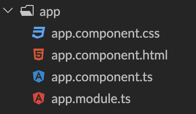

# Angular Files

We have bootstrapped a brand new Angular app in the console called "planes" by doing 

```
 ng new planes

 ```

 When has generated a new Angular project.  By default, we are given a default set of resources that represent all of the files that are associated with any given Angular component. 

 If you need any help scaffolding a new project in Angular, download the Angular CLI from 
 ```
 https://cli.angular.io/

```
and follow the instructions. This lesson assumes that you've downloaded the Angular CLI, installed everything, and are ready to go. 

 In Angular, each component has at least 4 files that work in harmony together.  Those files look something like this within a folder: 



The only two files that we will concern ourselves with here are the app.component.ts file, which we will call the component, and the app.component.html file  which we will call the view. 

The component is where variables are declared and modified. 
The view is an HTML file lives that receives variables from the component and displays them.  
 
We have built a 'hello world' example to show you how these files communicate with each other. 

COMPONENT
```js
  name = "Star student";
```

VIEW 
```html
  Hello, {{name}} ! 
```

We have set up this code on StackBlitz, which is an online Angular editor that allows you to run the code in a browser! In StackBlitz, the files are on the far left, the code is in the middle, and a small preview browser is on the right. You can view and or edit the code and see the result within seconds.
Alternatively, you can study the files in StackBlitz and try your best to resplicate the result yourself. Either way, this should help you get your feet wet in terms of studying the way that component files are connected in Angular, which is fairly intuitive. 

[view on StackBlitz](https://stackblitz.com/edit/angular-starter-example?file=src/app/app.component.ts)

The double curly braces around {{ name }} demonstrate what we call interpolation.  Interpolation is the insertion of variable content from the component into the view. 

Change some values in the component and see them change in the view either in StackBlitz or in your local Angular installation. 

### !challenge

* type: multiple-choice
* id: 4585859D-C7A0-40A5-8528-EAAB36109F5F
* title: Angular files

##### !question

In Angular, variables accessible in the view are defined

##### !end-question

##### !options

* In the module
* In the component
* In the view
* Within the context of interpolation in the view

##### !end-options

##### !answer
* In the component

##### !end-answer

<!-- other optional sections -->
<!-- !hint - !end-hint (markdown, users can see after a failed attempt) -->
<!-- !rubric - !end-rubric (markdown, instructors can see while scoring a checkpoint) -->
##### !explanation

the ****.component.ts file is where variables are defined. This is called "the component" for short. 

##### !end-explanation

### !end-challenge