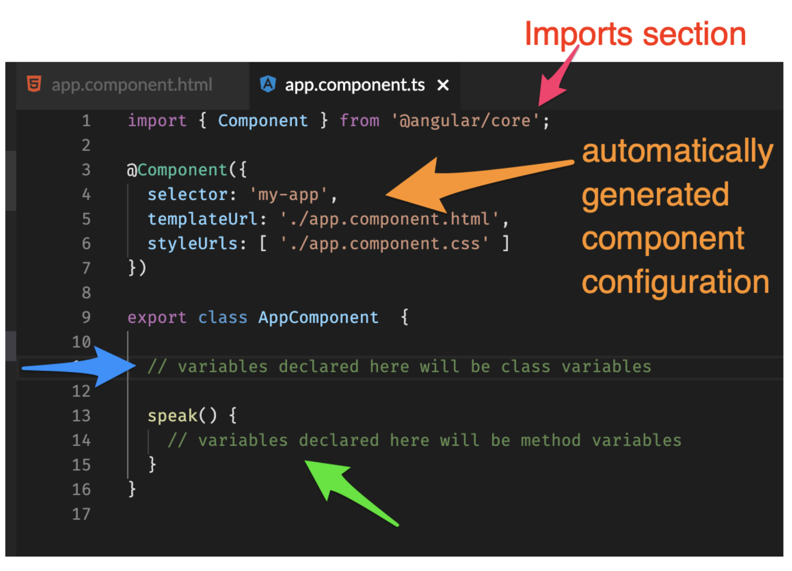
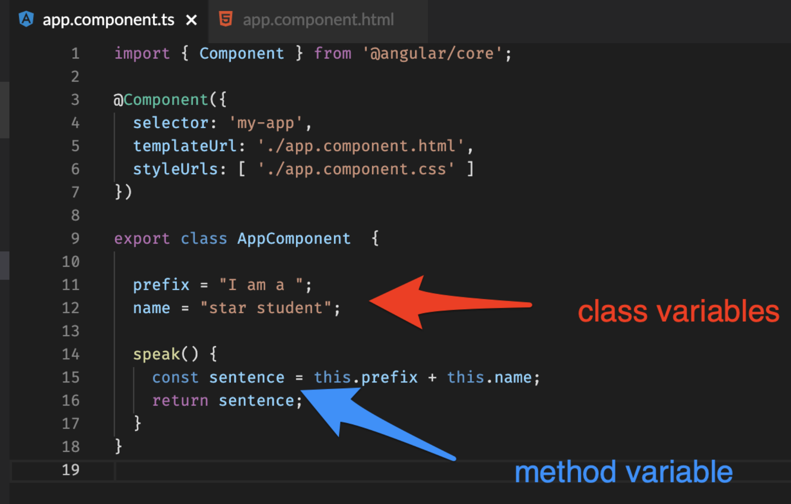

# Parts of a component

In our diagram below, we have 4 parts of a component that we want to cover in this part of our lesson, represented by arrows of four different colors. The red section is the "imports section". The orange arrow points to code automatically generated by Angular, we don't have to touch this part unless we want to change it. The blue arrow points to where class variables are declared.  Finally, the green arrow points to where method variables are declared. Class variables belong to the whole class, but method variables only apply within each method ( or 'function') that they live in.
 

 

Let's put some code into our speak() method to flesh out what instance variables vs method variables look like in practice:  




The variables prefix and name are class variables.  They belong to the class. 
Inside of the speak( ) method, if we want to invoke class members, we have to use this keyword. 

Also, note that inside of the speak( ) method, we are using the const keyword to declare the sentence variable.  INSIDE OF METHODS, you must use a keyword like var, let or const to declare variables. We chose const because const keywords declare a value that is a constant. It will not change. 


Note: We did not use static typing for the prefix, name, and sentence variables because the type was inferred when we initialized these variables with strings. 

In the view, we can call the speak method from the component and interpolate the answer right into the view. 

```html
<div class='box'>
    {{speak()}}
  </div>
```

Working code is worth a thousand words, so viewing the live demo on StackBlitz will make this crystal clear. Examine  *app.component.html* and *app.component.ts* and play around in the live code with the component and the view so that you can experience the interaction between both and see it update in real time. ( Note: altering the code may require you to create a free account ) 


[View and edit StackBlitz](https://stackblitz.com/github/nmuta/angular-class-vs-method-variables)


