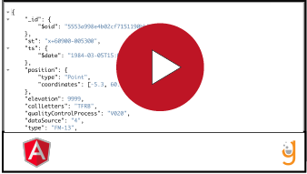

# Using http

Watch the video:

View on StackBlitz:
https://stackblitz.com/edit/angular-ivy-ybkv56?file=src%2Fapp%2Fflight.service.ts

View on GitHub: 
https://github.com/Nmuta/angular-flights-step-5

