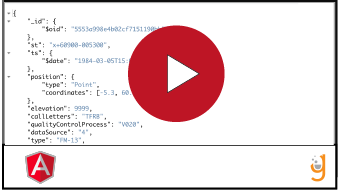

# Gitlab continuous delivery

This series of videos will walk you through the process of adding deployment targets to your front and back end projects respectively. 

As Pivotal Cloud Foundry ( PCF ) has discontinued its support of new user accounts as of September 2020, we will be deploying to Heroku as an alternative. 

Before watching these videos, you are required to set up a free account on Heroku. Follow the prompts at [https://www.heroku.com](https://www.heroku.com)

You will also need to install the Heroku CLI before beginning. Instructions to do that can be found [here](https://devcenter.heroku.com/articles/heroku-cli)

Please note that this video series will first walk you through setting up a back end Heroku CI / CD pipeline in GitLab. If you are new to the subject, whether you are a front or back end dev, you should watch the entire series. Front end is covered in the final videos, but the front end process builds upon the knowledge gained by understanding the inital examples that illustrate the process for back end. 

If you are already familiar with this process, you are free to skip any or all of the vidoes and proceed straight to the project. 

### !callout-info
# Videos: Setting up a Heroku CI / CD pipeline in Gitlab
| Subject                                                           | Video                        | Notes |
|---                                                        |---                              |---|
| Heroku login   |   | Logging into Heroku from the terminal |
| Connecting repo to Heroku remote |   | This video illustrates how to connect your local repository to a Heroku remote with git   |
| Getting ready to debug deploying Gradle apps on Heroku |   | Gradle deploys part 1  |
| Debugging a Gradle deploy for Java Spring Boot deployment |   | This video is optional . It debugs a Gradle deploy and helps you see how to fix Gradle issues when pushing to Heroku   |
| Full pipeline setup for Java Spring Boot |   | This video assumes a properly configured .gitlab-ci.yaml file exists and takes you all the way up to deploying and waiting for pipelines to pass |
| Showing a successful CD deployment |   | This video shows the result of a successful continuous delivery deployment in GitLab to a Java Spring Boot Heroku app |
| Setting up an Angular app for CD |   | This video shows the process of repeating the setup of a Gitlab 'CD to Heroku' app, but this time for Angular  |
| Setting up an Angular app for CD part 2 |   | This video shows the process of repeating the setup of a Gitlab 'CD to Heroku' app, but this time for Angular  |
| Debugging front end deploy |   | Using heroku logs --tail to debug a Heroku deployment   |
| Finishing the Angular deploy |   | Reconfiguring package.json and binding to a Heroku's port to complete the deployment   |
### !end-callout
 

