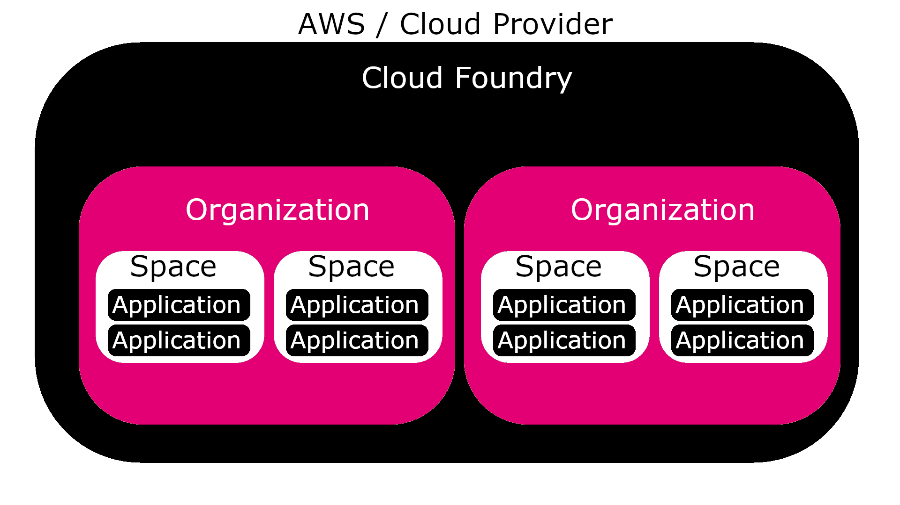

# Pivotal Cloud Foundry (PCF)

## Learning Objectives

By the end of this lesson you will be able to:

* Access logs of deployed applications

## Using PCF to Simplify Cloud Application Management

Cloud Foundry (CF) is an open source platform for deploying cloud native applications. It allows the user to take the cloud service provider, e.g. AWS or Google Cloud Platform, and abstract it.

With this, the application can be moved between services while avoiding changes to the infrastructure that you would otherwise be required to make.

PCF is a commercial implementation of CF developed by Pivotal. Because of the complexities of implementing the open source version, companies often elect to use PCF, especially on the enterprise level.

### CF Components

CF is comprised of several layers including routing, authentication, app lifecycle, app storage & execution, services, messaging, and, finally, a metrics and logging layer.

Routing and authentication handle the networking. The app lifecycle layer directs the application to storage and execution, where it attempts to run and repair itself if it crashes.

The services available can be found using the `cf marketplace` command. Finally, messaging handles internal networking, and metrics and logging provides data for the developer; logs can be pulled by using the `cf logs APPLICATION_NAME` command.

<!-- >>>>>>>>>>>>>>>>>>>>>> BEGIN CHALLENGE >>>>>>>>>>>>>>>>>>>>>> -->
### !challenge

* type: short-answer
* id: 048959c9-73b0-4b22-812a-486fdfdcbbf6
* title: CI/CD Problem Statement

##### !question
What command would you use to pull the logs for an application named `USER-SERVICE`?
##### !end-question

##### !placeholder

##### !end-placeholder

##### !answer
cf logs USER-SERVICE
##### !end-answer

### !end-challenge

<!-- ======================= END CHALLENGE ======================= -->

### CF Application Organization



Organizations are within the platform, and within those organizations there are spaces. Effectively, these are just folders to keep your applications organized. Often times, clients use organizations to separate their teams, and spaces to separate their test, production, and other environments. Clients can also restrict user access to organizations and spaces to keep their infrastructure secure.

### Manual Deployment

In order to deploy an application to a Cloud Foundry instance, you need a login, the instance URL, and the [CF CLI](https://docs.cloudfoundry.org/cf-cli/install-go-cli.html) to be installed. Additionally, the server must support the type of application you are pushing, and either you or the server must provide a buildpack for your application's language.

First construct a `manifest.yml` file within your project. The base information within is
```java
---
applications:
- name: YOUR-APP
  path: path/to/the/APPLICATION.jar
``` 
You can also change many more attributes within the manifest, which can be found within the [App Manifest Attribute Reference](https://docs.cloudfoundry.org/devguide/deploy-apps/manifest-attributes.html).

Then, login with `cf login`. Input the instance url, enter your login information, and select the space to push to. Finally, use the comman `cf push` and the application will deploy.

For More information about using [Cloud Foundry](https://docs.cloudfoundry.org) and [Pivotal Cloud Foundry](https://docs.pivotal.io) please reference the documentation.

