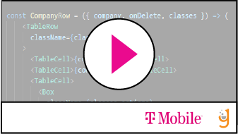

## Deploy your app to Conducktor

In this lesson, we will take an application and deploy it to Conducktor. You will, ideally, be able to deploy a back end Spring Boot Microservice _and_ a front end Angular application that will talk to each other within our provisioned Conducktor namespace at T-Mobile. 

Deploying to Conducktor takes a lot of steps.  Be patient with yourself, allow for error, and keep working through all of these exercises until you get the deployment right. In the end, you will gain a better understanding of how things are set up in Conducktor and you will be one step closer to understanding how Microservice deployments work within T-Mobile's Conducktor ecosystem. 

 Note: if you need to encode to base64 on windows, you can use [base64encode.org](https://www.base64encode.org/)


<table>
<tr><th> video </th><th> description </th></tr>
<tr>
<td>  
  <a href='https://drive.google.com/file/d/1pkk6z-WucD8Hqa3OfiqLjtmr1uKhOGuu/view'>  </a>
</td> 
<td>Containerizing an Angular app for deployment to Conducktor </td>
</tr>

<tr>
<td> 
 <a href='https://drive.google.com/file/d/1_yTTAWBNKXRMEn0erPNIeLYANl7l89Py/view'>  </a>
</td> 
<td>Creating our project in our T-Mobile workspace on Gitlab </td>
</tr>

<tr>
<td> 
  <a href='https://drive.google.com/file/d/1ItKznx_w1btrsddxfODIXFKLP4DXAtwV/view'>  </a>
</td> 
<td>Setting up Environment vars in Gitlab for Conducktor  </td>
</tr>

<tr>
<td> 
  <a href='https://drive.google.com/file/d/1-0etK3ktoG68Ix7jrhLy4xpt-5_OAWU9/view'>  </a>
</td> 
<td>Adding the .gitlab-ci.yml file . THIS VIDEO IS OPTIONAL ! If you don't want to hear the boring details about this file, you can just copy the file from the section at the bottom of the page and skip this video. Make sure to run it through a linter if the formatting gets messed up in the copy / paste process.  </td>
</tr>

<tr>
<td> 
  <a href='https://drive.google.com/file/d/1dQAeZ5S8bh6NN-fX7YIT4DKTc49mB7jk/view'>  </a>
</td> 
<td>Adding the JINJA file ( dev_deploy_info.yaml.j2 ) or whatever you want to call it... just needs to end in j2 and match what's in your gitlab-ci.yml file ( see below )  </td>
</tr>


<tr>
<td> 
  <a href='https://drive.google.com/file/d/1eniIMmw3qwc2jJeRJAbqGGdohXaAM05r/view'>  </a>
</td> 
<td>Adding our Conducktor secrets and creating our .j2 file. This is the most intricate of all of the videos. Nobody should skip this ! Please watch carefully.  </td>
</tr>

<tr>
<td> 
  <a href='https://drive.google.com/file/d/1ccKqreFyukWtpE06xG8nNfiCS8nAT8fR/view'>  </a>
</td> 
<td> Adding some final variables and pushing everything to GitLab to watch pipelines  </td>
</tr>

<tr>
<td> 
  <a href='https://drive.google.com/file/d/1l1_AcS5Yp4NKAiHNfSCTm5BKpUtFBGws/view'>  </a>
</td> 
<td> Debugging pipelines  </td>
</tr>

<tr>
<td> 
  <a href='https://drive.google.com/file/d/1yAsHU9cpw8yjD3KGA_QhiK2Ly4ZWxRKE/view'>  </a>
</td> 
<td> Fixed pipelines and final deploy  </td>
</tr>


 </table>
 


 

.gitlab-ci.yml file: 

```
include:
  - project: 'tmobile/templates'
    ref: tmo/master
    file: '/gitlab-ci/.tmo.global.common.gitlab-ci.yml'
      
  - project: 'tmobile/templates'
    ref: tmo/master
    file: '/gitlab-ci/.tmo.job.npm.gitlab-ci.yml'
  
  - project: 'tmobile/templates'
    ref: 'tmo/master' 
    file: 'gitlab-ci/.tmo.job.docker.gitlab-ci.yml'

  - project: 'tmobile/templates'
    ref: 'tmo/master' 
    file: 'gitlab-ci/.tmo.job.dockerScan.gitlab-ci.yml'


  - project: 'tmobile/templates'
    ref: tmo/master
    file: '/gitlab-ci/.tmo.function.duck-deploy.gitlab-ci.yml'
  
stages:
  - tmo
  - test
  - build
  - package
  - ci
  - deploy
  
# put these above any custom jobs 
variables:
  # how registry image gets named and semantically versioned.
  EXTRA_DOCKER_TAG: "$CI_REGISTRY_IMAGE/$CI_COMMIT_REF_SLUG:$CONTAINER_VERSION.$CI_PIPELINE_IID"

  
deploy-dev:
  stage: deploy
  extends: .duck_deploy
  # this part was outdated in the docs ( below )
  variables:
    CONDUCKTOR_CONFIG_PATH: ./dev_deploy_info.yaml
    GIT_DEPTH: 1
    CONDUCKTOR_NS: wfo-dev-duck-dev-w2
    CONDUCKTOR_TARGET: duck-dev-w2 
  extends: .duck_deploy
  environment:
    name: dev

```