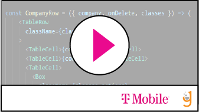

# PUML CFU

### VIDEO DEMO: USING PUML

Answer the questions below to demonstrate your understanding of topics covered today.

<!--BEGIN CHALLENGE-->

### !challenge

* type: multiple-choice
* id: a7ace77a-5d26-4678-a233-5232e9a28397
* title: PUML
* points: 1
* topics: puml

##### !question

What does PUML stand for?

##### !end-question

##### !options

* Please Use My Language 
* Put Under Major Layer
* Plant Unified Modeling Language 
* Pythons Ultra Markup Language

##### !end-options

##### !answer

* Plant Unified Modeling Language 

##### !end-answer

### !end-challenge

<!--END CHALLENGE-->

<!--BEGIN CHALLENGE-->

### !challenge

* type: short-answer
* id: 03d6b22d-4d48-443a-924c-c9910bff90fc
* title: Your thoughts?
* points: 1
* topics: puml

##### !question
Please provide your opinion below.

How do you feel about PUML? 
Is it cool? 
Confusing? 
Is there value?

##### !end-question

##### !answer

/([A-Z,a-z])\w+/

##### !end-answer

##### !placeholder

You answer here

##### !end-placeholder

### !end-challenge

<!--END CHALLENGE-->

<!--BEGIN CHALLENGE-->

### !challenge

* type: project
* id: 1d8be446-5ec8-4b2e-879f-23c915795633
* title: Creating a sequence diagram via PUML
* points: 1
* topics: puml

##### !question

1. Create a repo
2. Add a file sendIt.puml
3. Build a representation of the sequence below
4. Save and push your solution to your repo
5. Paste the URL to your repo below

- **Account Owner** logs into tmobile.com **UI**
- **UI** performs GET to **TMO_Orchestrator (142.52.9.12/account/${account_number})** inside _TMO_Firewall_
- **TMO_Orchestrator** authenticates with **TMO_TAAP**
- **TMO_TAAP** sends successful authentication **TMO_Orchestrator**
- **TMO_Orchestrator** performs GET to **TMO_UserService (142.52.9.25/user_list/${account_number})**
- **TMO_UserService** returns a _list_of_users_ to **TMO_Orchestrator**
- **TMO_Orchestrator** performs GET to **TMO_DeviceService (142.52.9.42/device_list/${list_of_users})**
- **TMO_DeviceService** returns a _list_of_user_device_pairs_ to **TMO_Orchestrator**
- **TMO_Orchestrator** returns _account_details_ to **UI** outside _TMO_Firewall_
- **UI** displays information to **Account Owner**

**Stretch Goal**
Building off the sequence above:
- Map out the flow of what failed authentication might look like
- Map the flow you imagine if the account owner wants to add a device
    - Feel free to make any assumptions necessary

##### !end-question

##### !placeholder

Submit Your Repo Here

##### !end-placeholder

##### !hint
[The Online Editor](http://www.plantuml.com/plantuml/umla/)
[PUML Docs](https://plantuml.com/)
##### !end-hint

### !end-challenge

<!--END CHALLENGE-->
