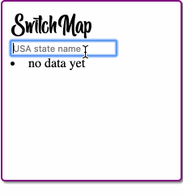
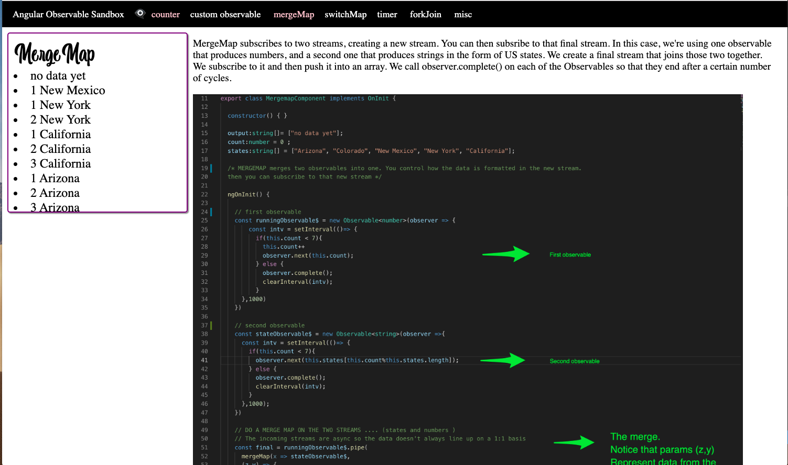

## Reactive programming

RxJS is a library for composing asynchronous and event-based programs by using observable sequences. It provides one core type, the Observable, satellite types (Observer, Schedulers, Subjects) and operators inspired by Array#extras (map, filter, reduce, every, etc) to allow handling asynchronous events as collections.

Think of RxJS as Lodash for events.

ReactiveX combines the Observer pattern with the Iterator pattern and functional programming with collections to fill the need for an ideal way of managing sequences of events.

The essential concepts in RxJS which solve async event management are:

*Observable*: represents the idea of an invokable collection of future values or events.

*Observer*: is a collection of callbacks that knows how to listen to values delivered by the Observable.

*Subscription*: represents the execution of an Observable, is primarily useful for cancelling the execution.

*Operators*: are pure functions that enable a functional programming style of dealing with collections with operations like map, filter, concat, reduce, etc.

*Subject*: is equivalent to an EventEmitter, and the only way of multicasting a value or event to multiple Observers.

*Schedulers*: are centralized dispatchers to control concurrency, allowing us to coordinate when computation happens on e.g. setTimeout or requestAnimationFrame or others.

It's easiest to understand how RXJS works by looking at examples. 

[Fork and Clone this repo](https://github.com/gSchool/rxjsStuff) and use these examples to form a base udnerstanding of how rxjs works. 

Then create your own StackBlitz project that utilizes a minimum of 3 RXJS examples of your own. Use any 3 ( or more ) examples from this page
[https://www.learnrxjs.io/learn-rxjs/operators](https://www.learnrxjs.io/learn-rxjs/operators)

### !challenge

* type: project
* id: rxjsHEMA-EC86-4015-9AA8-28dka2320p9s
* title: RXJS
* topics: Reactive programming  
##### !question
Paste the URL of your Stackblitz project that demonstrates at least 3 of your own rxjs examples
##### !end-question

 

##### !answer
* Answer
##### !end-answer

<!-- other optional sections -->
<!-- !hint - !end-hint (markdown, users can see after a failed attempt) -->
<!-- !rubric - !end-rubric (markdown, instructors can see while scoring a checkpoint) -->
##### !explanation

Thank you for your submission

##### !end-explanation

### !end-challenge

