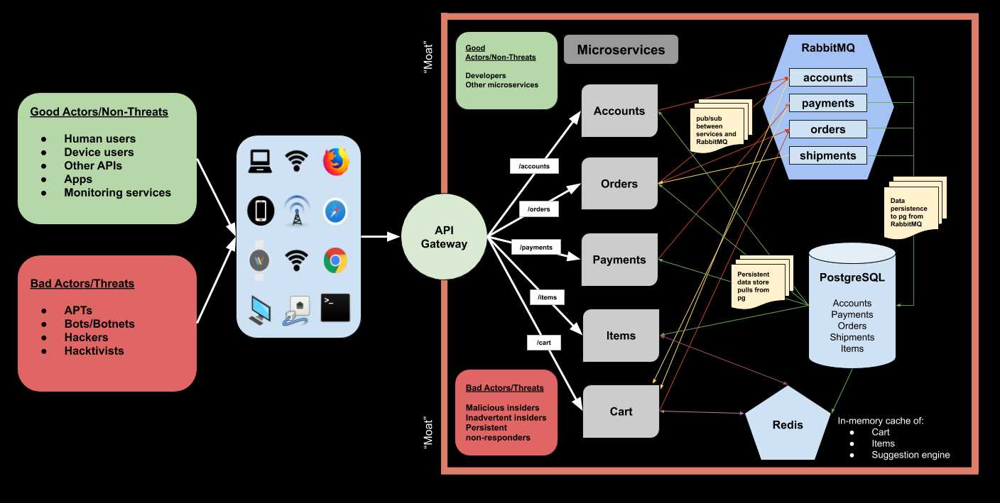

# Zero-Trust Philosophy Checkpoint

Review the following architecture diagram that we looked at during the discussion, and identify its vulnerabilities. Then, complete this checkpoint to demonstrate how you would improve this architecture. 

## Important Information:

* *The only thing that the API gateway currently does is validate usernames and passwords.*
* *Do not assume anything that isn't in the diagram to have been implemented.*
* *Use the zero-trust mantra of "Never Trust, Always Verify" to help choose the best answer.*
* Please read the questions carefully, and do not answer too quickly. 
* Some answers may be better than others.
* Take your time and think critically.

<!--BEGIN CHALLENGE-->

### !challenge

* type: multiple-choice
* id: dfb1ea49-b567-42cc-ad69-ab98149b4595
* title: The crux of the problem.
* points: 2

##### !question

What is the crux of the problem with this architecture?

##### !end-question

##### !options

* Bad actors may perform operations inside the trusted zone.
* The architecture is too complex.
* Once you are allowed throught the API Gateway, it seems like you may access to everything.
* Human users and machine users have access to the API endpoints.

##### !end-options

##### !answer

Once you are allowed throught the API Gateway, it seems like you may access to everything.

##### !end-answer

##### !explanation

##### !end-explanation

### !end-challenge

<!--END CHALLENGE-->

<!--BEGIN CHALLENGE-->

### !challenge

* type: multiple-choice
* id: 77ccad32-e345-4745-ac0b-e44c787bd011
* title: What happens if a regular user of this application changes their device?

##### !question

Imagine that a regular user of this application changes their device from their iPhone to their laptop. What would happen given this application architecture?

##### !end-question

##### !options

* The user would be required to reauthenticate before making purchases.
* The user would not be able to make purchases.
* The user would need to reset their password to use the application.
* The application would not change its behavior.

##### !end-options

##### !answer

The application would not change its behavior.

##### !end-answer

##### !explanation

##### !end-explanation

### !end-challenge

<!--END CHALLENGE-->

<!--BEGIN CHALLENGE-->

### !challenge

* type: multiple-choice
* id: 1d35ab21-8415-4679-81a0-7e74bcdef495
* title: What might be implemented to verify that the user is still the same user when their device changes?
* points: 2

##### !question

Given the scenario in the previous question what might be done better?

##### !end-question

##### !options

* No changes should be made, the user should be allowed to freely use the application when they change their device.
* A device inventory might be implemented, which would require the user to reauthenticate before using the application's sensitive features.
* The user's iPhone should not be allowed to use the application.
* The user's laptop should receive a cookie to identify the user.

##### !end-options

##### !answer

A device inventory might be implemented, which would require the user to reauthenticate before using the application's sensitive features.

##### !end-answer

##### !explanation

##### !end-explanation

### !end-challenge

<!--END CHALLENGE-->

<!--BEGIN CHALLENGE-->

### !challenge

* type: multiple-choice
* id: 9a0f3b12-3591-43c2-abd8-84a4d874372e
* title: What happens if a regular user of this application travels to Colombia?

##### !question

Imagine that a regular user of this application travels to Colombia. What would happen given this application architecture?

##### !end-question

##### !options

* The user would be asked what they are doing in Colombia.
* The user would not be able to see their purchases.
* The user will be able to see their order history.
* The user's shipments will not be sent to their new Colombian address.

##### !end-options

##### !answer

The user will be able to see their order history.

##### !end-answer

##### !explanation

##### !end-explanation

### !end-challenge

<!--END CHALLENGE-->

<!--BEGIN CHALLENGE-->

### !challenge

* type: multiple-choice
* id: 056dfd52-0a80-42cd-9a3b-dfbce16f8555
* title: The Colombian traveler logs into the application 2 minutes after being logged in at their previous location of New York City, NY.
* points: 2

##### !question

How should the application respond if the Colombian traveler from the previous question logged into the application 2 minutes after being first logged in at their previous location of New York City, NY?

##### !end-question

##### !options

* The user should be asked what they are doing in Colombia.
* The user should be required to re-authenticate.
* The user should be required to re-authenticate, and the activity should be logged.
* The user should not need to do anything special and use the application as before.

##### !end-options

##### !answer

The user should be required to re-authenticate, and the activity should be logged.

##### !end-answer

##### !explanation

##### !end-explanation

### !end-challenge

<!--END CHALLENGE-->

<!--BEGIN CHALLENGE-->

### !challenge

* type: multiple-choice
* id: 934f01d2-2f9f-49c0-b2fe-f4f0b5f44126
* title: The Starbucks user.

##### !question

What happens when a user of the application goes to a Starbucks and uses the WiFI network instead of their home network?

##### !end-question

##### !options

* The user should be asked what kind of Coffee they like to drink.
* The user is allowed to use the application without any changes.
* The user's usage patterns have been monitored by a part of this application, and to reduce friction, they should be allowed to use the application without issue.
* The user is required to reauthenticate.

##### !end-options

##### !answer

The user is allowed to use the application without any changes.

##### !end-answer

##### !explanation

##### !end-explanation

### !end-challenge

<!--END CHALLENGE-->

<!--BEGIN CHALLENGE-->

### !challenge

* type: multiple-choice
* id: 1f9af368-f9d5-40e5-bb05-0c969d9f0ca9
* title: What might be done about the Starbucks user?
* points: 2

##### !question

What should be implemented to address the case of the Starbucks user better?

##### !end-question

##### !options

* A usage patterns monitoring and decision service should be implemented that may inform the application auth service how to respond to network use pattern anomalies.
* Nothing new should be implemented.
* A logging service should be implemented to notify the application security team about the user's behavior.
* A prompt to ask the user to reset their network connection should be implemented.

##### !end-options

##### !answer

A usage patterns monitoring and decision service should be implemented that may inform the application auth service how to respond to network use pattern anomalies.

##### !end-answer

##### !explanation

##### !end-explanation

### !end-challenge

<!--END CHALLENGE-->

<!--BEGIN CHALLENGE-->

### !challenge

* type: multiple-choice
* id: d04354a4-7fbe-4e05-8fe0-f0a532266dca
* title: What needs to be implemented to prevent some users from viewing certain items?
* points: 1

##### !question

Let's pretend that there are some younger users who shouldn't be able to purchase certain movies on the store due to their ratings?

##### !end-question

##### !options

* Users should be able to see anything in the store. 
* An authentication (AuthN) service should be implemented to control users' logins.
* An authorization (AuthZ) scheme should be implemented that controls what these users may view.
* A password should be required of all users to log into the application.

##### !end-options

##### !answer

An authorization (AuthZ) scheme should be implemented that controls what these users may view.

##### !end-answer

##### !explanation

##### !end-explanation

### !end-challenge

<!--END CHALLENGE-->

<!--BEGIN CHALLENGE-->

### !challenge

* type: multiple-choice
* id: e45cf4b6-afba-4a6a-9c20-345b03b7aa88
* title: Developers of the application being able to see user data.
* points: 1

##### !question

What currently seems to be the case about developers of the application?

##### !end-question

##### !options

* It seems that developers may push code to production.
* It seems that developers would need to get permission to push code to production.
* Developers of the application may access user data freely, with no controls in place.
* Developers may only see users' aggregated purchase history.

##### !end-options

##### !answer

* Developers of the application may access user data freely, with no controls in place.

##### !end-answer

##### !explanation

##### !end-explanation

### !end-challenge

<!--END CHALLENGE-->

<!--BEGIN CHALLENGE-->

### !challenge

* type: multiple-choice
* id: 52b92294-468f-4d89-a336-0bc926117ef0
* title: What happens in this application if an intrusion by a hacker were to take place?

##### !question

A hacker logged in with valid credentials. What would the hacker have been able to do with those credentials?

##### !end-question

##### !options

* The hacker would not be allowed to use the application.
* The hacker's activity would be logged.
* The hacker would seemingly be able to retrieve any information with no issue.
* The hacker is an ethical hacker, and will report their findings to the application developers for later fixes.

##### !end-options

##### !answer

The hacker would seemingly be able to retrieve any information with no issue.

##### !end-answer

##### !explanation

##### !end-explanation

### !end-challenge

<!--END CHALLENGE-->

<!--BEGIN CHALLENGE-->

### !challenge

* type: multiple-choice
* id: 40fea2d7-fe34-450b-a666-f14ba405856d
* title: What should happen on every request?

##### !question

When new requests to the application are made, what should be done?

##### !end-question

##### !options

* The user's identity, device, network, geographic location, and authorization to issue the request should be re-validated.
* The user's username and password should be re-validated.
* The user should be allowed to use any of the endpoints.
* The user should be checked against a known list of hackers.

##### !end-options

##### !answer

The user's identity, device, network, geographic location, and authorization to issue the request should be re-validated.

##### !end-answer

##### !explanation

##### !end-explanation

### !end-challenge

<!--END CHALLENGE-->

<!--BEGIN CHALLENGE-->

### !challenge

* type: checkbox
* id: c1ae61ba-bf3e-407e-9938-f26aae977daa
* title: Choose all the TRUE statements about this application.

##### !question

Carefully select all the TRUE statements below.

##### !end-question

##### !options

* When it comes AuthN and AuthZ, this application only checks the user's username and password.
* This application does not seem to authenticate users.
* This application authenticates users, but does not verify them on every request.
* This application trusts always, and verifies nothing.

##### !end-options

##### !answer

* When it comes AuthN and AuthZ, this application only checks the user's username and password.
* This application authenticates users, but does not verify them on every request.

##### !end-answer

##### !explanation

##### !end-explanation

### !end-challenge

<!--END CHALLENGE-->

<!--BEGIN CHALLENGE-->

### !challenge

* type: checkbox
* id: 67e924eb-edb1-4294-b8d6-76ef62d9782a
* title: Choose all the FALSE statements about this application.

##### !question

Carefully select all the FALSE statements below.

##### !end-question

##### !options

* Ethical hackers have a way to report vulnerabilities in this application.
* The application checks the user's network connection properties on each request.
* The application validatest that the logged in user is allowed to access certain parts of the application.
* The application implements the zero-trust mantra.

##### !end-options

##### !answer

* The application checks the user's network connection properties on each request.
* The application validatest that the logged in user is allowed to access certain parts of the application.
* The application implements the zero-trust mantra.

##### !end-answer

##### !explanation

##### !end-explanation

### !end-challenge

<!--END CHALLENGE-->

<!--BEGIN CHALLENGE-->

### !challenge

* type: short-answer
* id: 47402c9e-0204-40c8-8997-b149b00410a0
* title: Describe any other thoughts about this application.

##### !question

Describe any other things you might do about this application, which might help make it more aligned with the Zero-Trust philosophy. Don't worry about being wrong or right on this one. You get credit for any answer on this one. Consider it a freebie for all your hard work to this point.

##### !end-question

##### !answer
/.*/
##### !end-answer

##### !placeholder
...
##### !end-placeholder

##### !explanation

Don't worry about being wrong or right on this one. You get credit for any answer on this one.

##### !end-explanation

### !end-challenge

<!--END CHALLENGE-->