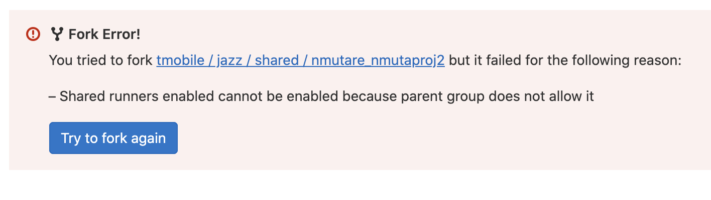

## Software Development Lifecycle with Jazz

Jazz docs focusing on the Software Development Lifecycle: 

[https://docs.jazz.corporate.t-mobile.com/using-jazz/start-here/understand-dev-lifecycle/](https://docs.jazz.corporate.t-mobile.com/using-jazz/start-here/understand-dev-lifecycle/)

Note : The above image outlines the JAZZ SDLC.  Part of this process is creating a Jazz deployment, visiting the repo that it created for you, forking it, cloning it, making dev changes, pushing new code, submitting MR to master, etc.  

When you go through this process, if you're developing quickly, you may get this error: 

This is because Jazz creates deployments with shared runners by default. A job runs every 30 minutes to disable shared runners on all new projects.  So you may need to wait again and re-deploy after 30 minutes from the inital deployment. We apologize for any inconvenvience this may cause, and we are looking into ways to streamline this process. 

