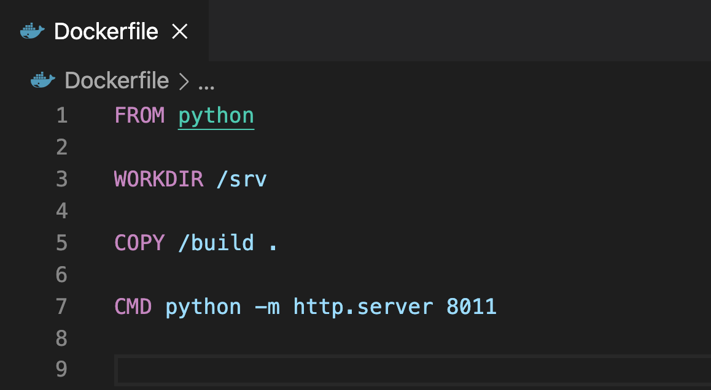

# T-Mobile Final Checkpoint 

Complete the following checkpoint to demonstrate your understanding.

## Important Information:

* Please read the questions carefully, and do not answer too quickly. 
* These questions are pretty straight forward, but take your time and think critically.

<!--BEGIN CHALLENGE-->

### !challenge

* type: multiple-choice
* id: f621eceb-c84d-4cfd-803d-f60da76fin1a
* title: Triggering pipelines

##### !question

The presence of a _________ file in GitLab will trigger pipelines to run when code is pushed via git. 

##### !end-question

##### !options

* manifest.yml
* .gitlab-ci.yml
* .j2 ('jinja')
*  Dockerfile

##### !end-options

##### !answer

* .gitlab-ci.yml

##### !end-answer

##### !explanation

##### !end-explanation

### !end-challenge

<!--END CHALLENGE-->

<!--BEGIN CHALLENGE-->

### !challenge

* type: multiple-choice
* id: c7d7905b-70a8-4b30-98ab-6ba1953fin2a
* title: Continuous delivery

##### !question

In the CI/CD workflow at T-Mobile, which of the following is an example of continous delivery? 

##### !end-question

##### !options

* Docker images being pushed to T-Mobile's image registry
* Configuring delivery tokens in GitLab
* Docker images being deployed to AWS after pipelines pass
* Conducktor container scans

##### !end-options

##### !answer

* Docker images being deployed to AWS after pipelines pass

##### !end-answer

##### !explanation

##### !end-explanation

### !end-challenge

<!--END CHALLENGE-->

<!--BEGIN CHALLENGE-->

### !challenge

* type: multiple-choice
* id: c8cff51d-9313-4fb8-84f1-9ead088fin3a
* title: Docker problem

##### !question



You have downloaded a repo containing a simple web application that's served up by a python simple server that is meant to be containerized. Upon building running the container , the container runs, but you are unable to see anything running on port 8011.  What is the problem ? 

##### !end-question

##### !options

* The port must be set to 8080 to run correctly
* The wrong python command is being used to run the server
* You must EXPOSE the port inside of the Dockerfile
* The container must first be hosted on a registry

##### !end-options

##### !answer

* You must EXPOSE the port inside of the Dockerfile

##### !end-answer

##### !explanation

##### !end-explanation

### !end-challenge

<!--END CHALLENGE-->

<!--BEGIN CHALLENGE-->

### !challenge

* type: multiple-choice
* id: 62ba892d-9320-4290-b57b-58431adfin4a
* title: Docker build

##### !question

If you run 
``` docker build -t your_repo_name/products_api:latest ```
What does "latest" refer to ? 

##### !end-question

##### !options

* latest is the tag of the Docker image
* latest refers to the previous build
* latest refers to the latest Docker version
* latest refers to the age of the container

##### !end-options

##### !answer

* latest is the tag of the Docker image

##### !end-answer

##### !explanation

##### !end-explanation

### !end-challenge

<!--END CHALLENGE-->

<!--BEGIN CHALLENGE-->

### !challenge

* type: multiple-choice
* id: 1fcb7a91-43c8-4bad-aeaf-0da09c4fin5a
* title: PCF set up

##### !question

Which of the following is required for a PCF deployment at T-Mobile ? 

##### !end-question

##### !options

* application.properties file
* .j2 (jinja) file
* Dockerfile
* manifest.yml

##### !end-options

##### !answer

* manifest.yml

##### !end-answer

##### !explanation

##### !end-explanation

### !end-challenge

<!--END CHALLENGE-->

<!--BEGIN CHALLENGE-->

### !challenge

* type: checkbox
* id: 1855d2c8-8f4c-4ccb-bf87-da87406fin6a
* title: Conducktor env variables 

##### !question

Which of the following GitLab environmental variables are needed for a Conducktor deployment at T-Mobile ? (CHECK ALL THAT APPLY).

##### !end-question

##### !options

* CONDUCKTOR_USER
* CONDUCKTOR_PASS_BASE64 OR CONDUCKTOR_PASS
* CONDUCKTOR_VERSION
* CONTAINER_VERSION

##### !end-options

##### !answer

* CONDUCKTOR_USER
* CONDUCKTOR_PASS_BASE64 OR CONDUCKTOR_PASS
* CONTAINER_VERSION

##### !end-answer

##### !explanation

##### !end-explanation

### !end-challenge

<!--END CHALLENGE-->

<!--BEGIN CHALLENGE-->

### !challenge

* type: multiple-choice
* id: f1d1a679-b42b-4ff9-8e70-58ac24afin7a
* title: Microservices

##### !question

Which of the following is NOT a typical benefit of Microservice architecture as opposed to a monolith server structure? 

##### !end-question

##### !options

* Independently scalable services 
* Reduced server costs for the company
* Simplicity
* Faster Deployments

##### !end-options

##### !answer

* Simplicity

##### !end-answer

##### !explanation

##### !end-explanation

### !end-challenge

<!--END CHALLENGE-->

<!--BEGIN CHALLENGE-->

### !challenge

* type: multiple-choice
* id: 2e24db4c-5868-41c1-8a4a-506c418fin8a
* title: PUML

##### !question

How is PUML used at T-Mobile?

##### !end-question

##### !options

* Modeling application flows
* Diagramming data entities
* Auto-generating api endpoint documentation
* initializing deployments

##### !end-options

##### !answer

* Modeling application flows

##### !end-answer

##### !explanation

##### !end-explanation

### !end-challenge

<!--END CHALLENGE-->

<!--BEGIN CHALLENGE-->

### !challenge

* type: checkbox
* id: d810099f-5dcc-4202-a7ed-f6385c2fin9a
* title: TAAP

##### !question

Which of the following are true about T-Mobile TAAP ? ( SELECT ALL THAT APPLY)

##### !end-question

##### !options

* TAAP is an API Security standard in your apis 
* TAAP can use JWTs in the process of authenticating users
* TAAP removes the need for a centralized identity provider 
* TAAP only authenticates users when they first login

##### !end-options

##### !answer

* TAAP is an API Security standard in your apis 
* TAAP can use JWTs in the process of authenticating users
* TAAP removes the need for a centralized identity provider 

##### !end-answer

##### !explanation

##### !end-explanation

### !end-challenge

<!--END CHALLENGE-->

<!--BEGIN CHALLENGE-->

### !challenge

* type: multiple-choice
* id: d810099f-5dcc-4202-a7ed-f6385c2fin9b
* title: Gitlab pipelines

##### !question

How would you add a "test" stage in a GitLab pipeline ? 

##### !end-question

##### !options

* adding a stage called "test" under the .gitlab-ci.yaml stages section
* toggling the "add tests" section in GitLab settings
* simply including test files in the actual repo
* implementing a TDD workflow in your project

##### !end-options

##### !answer

* adding a stage called "test" under the .gitlab-ci.yaml stages section

##### !end-answer

##### !explanation

##### !end-explanation

### !end-challenge

<!--END CHALLENGE-->
